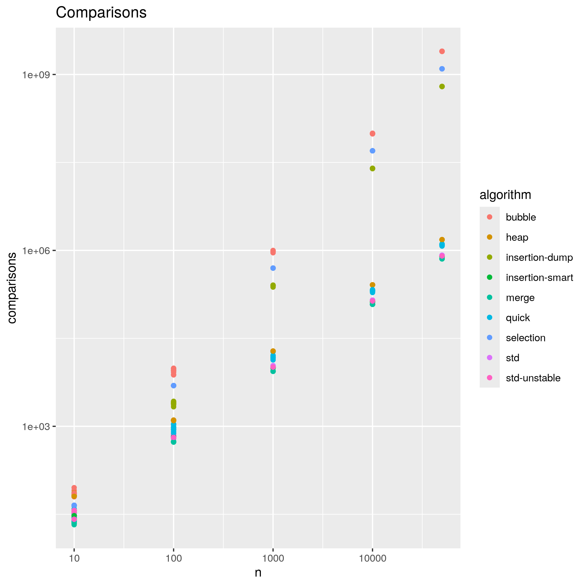
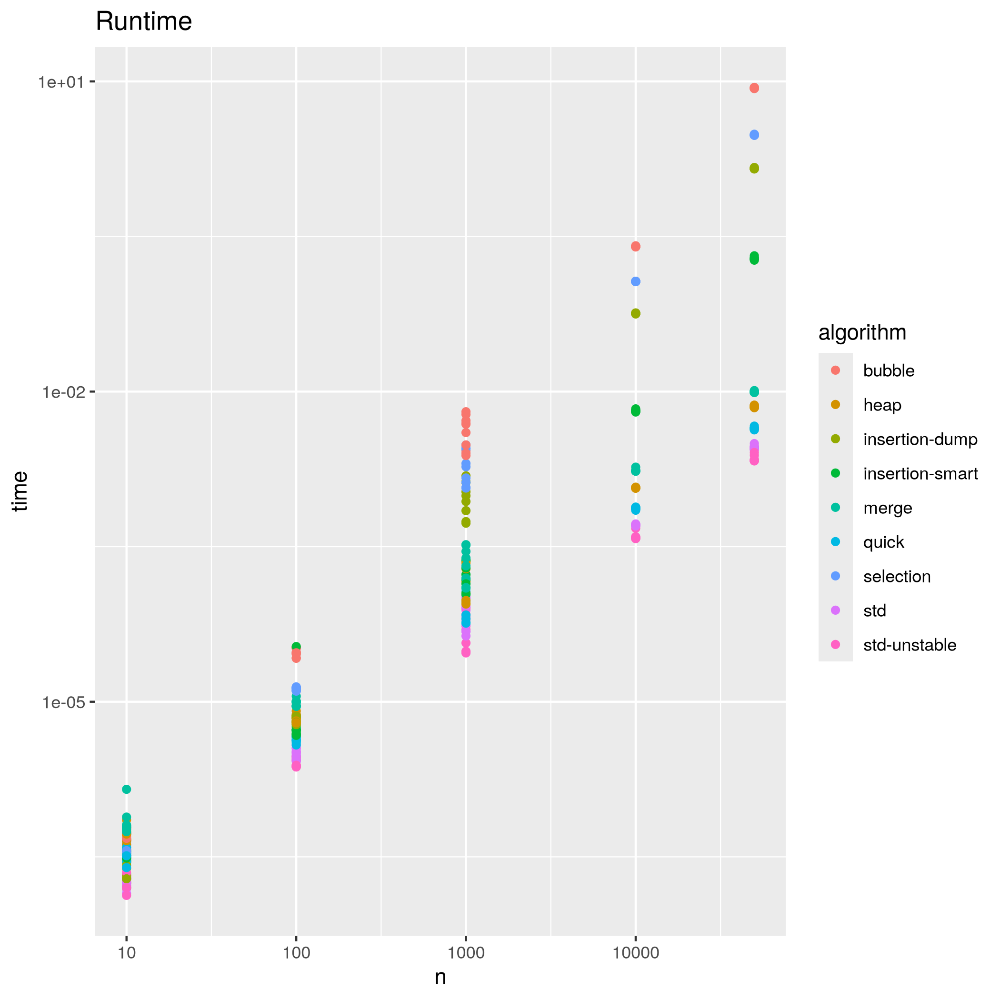

# Sort

## Usage

```sh
$ cargo run --release > values.dat
$ cd scripts/
$ Rscript install_packages.R
$ Rscript plot.R
$ mv images/ ..
```

Or with docker:

```sh
$ cargo run --release > values.dat
$ docker build --rm --force-rm -t rplot .
$ docker run -d rplot
<container-id>
$ docker cp <container-id>:/usr/local/src/myscripts/images/ .
```

then you can see benchmark of camparisons and runtime in two PNG pictures in current directory (camparisons.png and runtime.png).

## Benchmark





