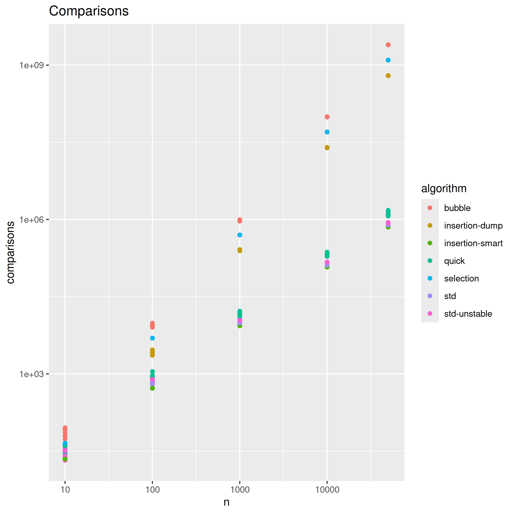
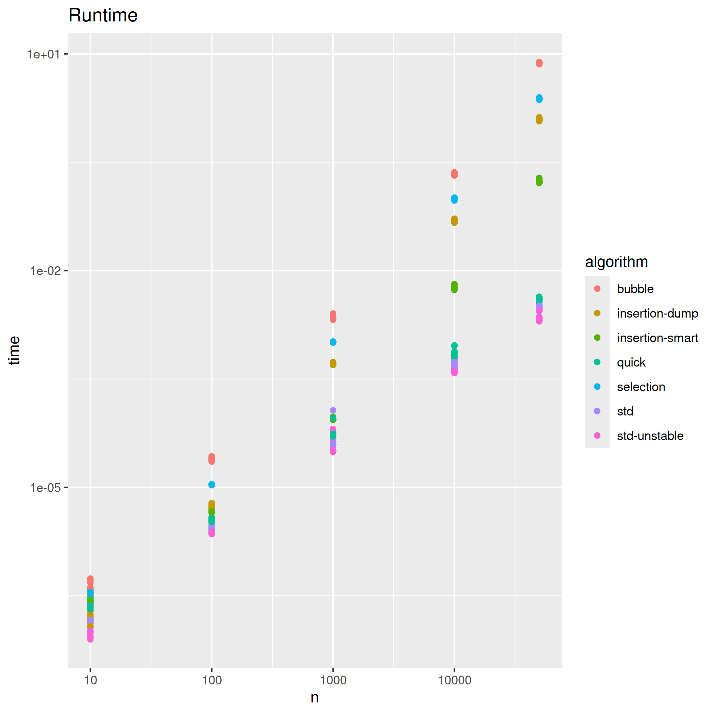

# Sort

## Usage

```bash
$ cargo run --release > values.dat
$ Rscript plot.R
```

then you can see benchmark of camparisons and runtime in two PNG pictures in current directory (camparisons.png and runtime.png).

## Benchmark





